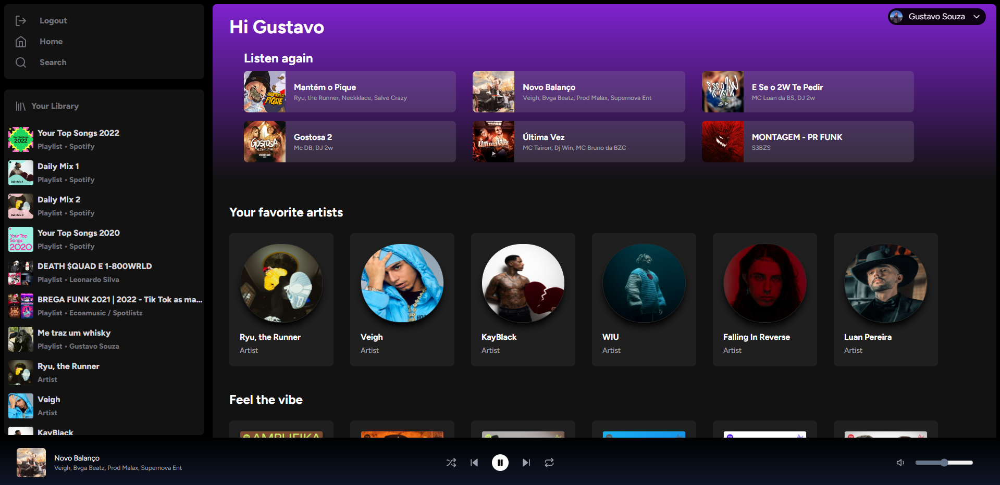
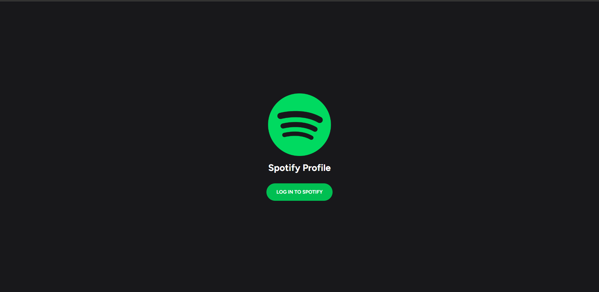
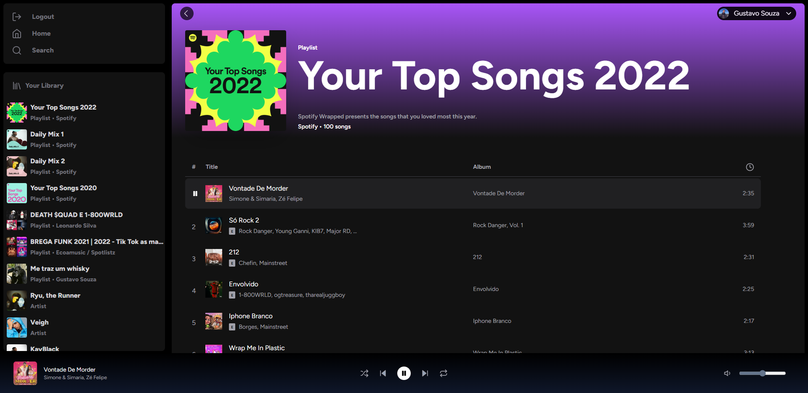
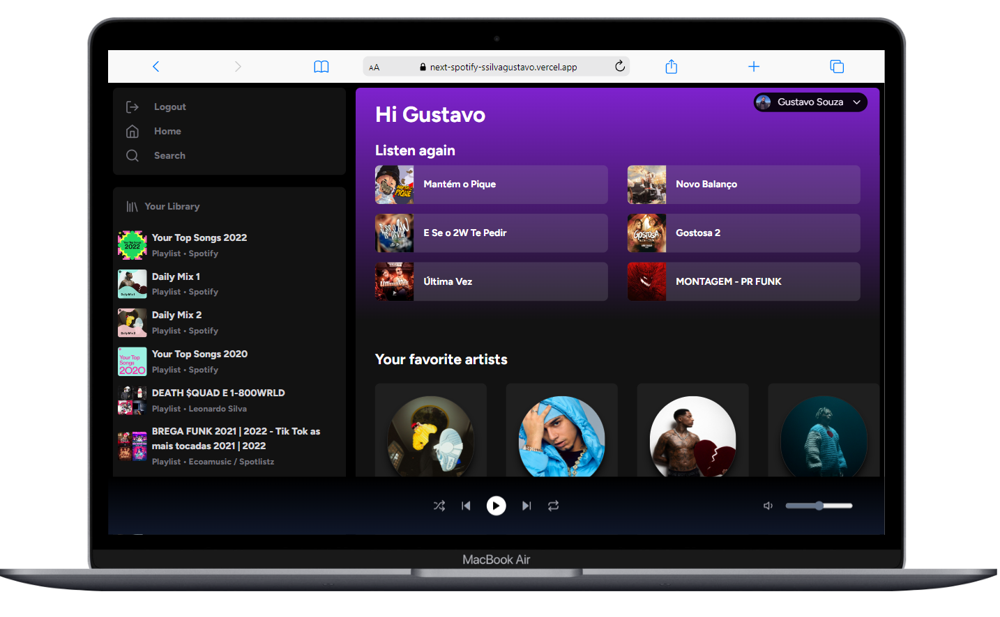
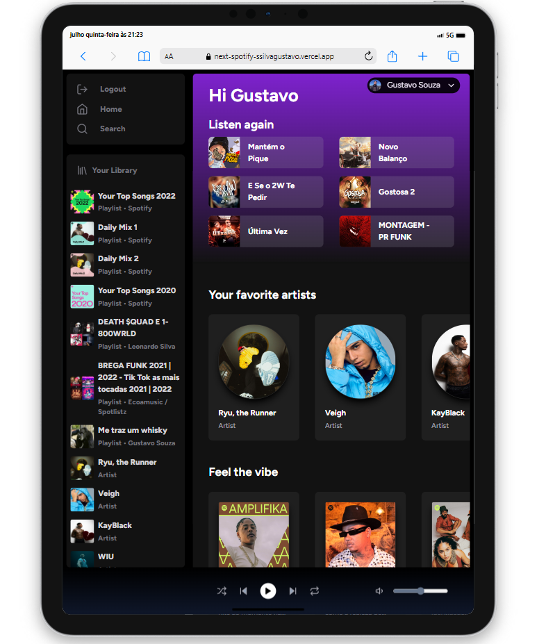

   <h1>SPOTIFY API</h1>

 

   
    
    

 

   

 
<a href="#english"><b><i>Read it in English</i></b></a>
 
 

[**Links**](#-links) &nbsp;&nbsp;**|**&nbsp;&nbsp;
[**Projeto**](#-projeto) &nbsp;&nbsp;**|**&nbsp;&nbsp;
[**Tecnologias**](#-tecnologias) &nbsp;&nbsp;**|**&nbsp;&nbsp;
[**Instalação**](#-instalação) &nbsp;&nbsp;**|**&nbsp;&nbsp;

## 🔗 Links

O projeto pode ser acompanhado através do link: <a href="https://next-spotify-ssilvagustavo.vercel.app/" target="_blank">**SpotifyAPI**</a>.

## 🎮 Projeto

 

**SpotifyAPI** é o projeto desenvolvido utilizando a API do Spotify esta plataforma tem como objetivo um site personalizado do spotify com algumas novidades como seus top artistas e musicas recém escutadas.

 
 

 

 

 
 

Projeto totalmente responsivo e funcional.

 

## 🚀 Tecnologias

<ul>
   <li>Typescript (https://www.typescriptlang.org/)</li>
   <li>NextJS (https://nextjs.org/)</li>
   <li>Next Auth (https://next-auth.js.org/)</li>
   <li>ReactJS (https://reactjs.org/)</li>
   <li>RecoilJS (https://recoiljs.org/)</li>
   <li>Tailwind CSS (https://tailwindcss.com/)</li>
   <li>Spotify API (https://developer.spotify.com/documentation/web-api)</li>
   <li>Lucide Icons (https://lucide.dev/)</li>
   <li>Vercel - Hospedagem Web/Server (https://vercel.com/)</li>
</ul>

## 🔧 Instalação

1. Renomeie o arquivo `.env.example` para `.env` e siga as instruções e links no arquivo
1. Instale o projeto rodando o comando `npm install`, `yarn install` ou `pnpm install` no seu terminal
1. Inicie o servidor da web em outro terminal, rodando `npm run dev`, `yarn dev` ou `pnpm run dev`
1. Para utilizar o aplicativo web, basta abrir [http://localhost:3000](http://localhost:3000) em algum browser

## 💡 Contribuição

- Faça um **_fork_** desse repositório;
- Crie um **branch** para a sua feature: `git checkout -b minha-feature`;
- Faça um **commit** com suas alterações: `git commit -m 'feat: Minha nova feature'`;
- Faça um **push** para a sua branch: `git push origin minha-feature`;
- Faça um **pull request** com sua feature;

Pull requests são sempre bem-vindos. Em caso de dúvidas ou sugestões, crie uma _**issue**_ ou entre em contato comigo.

---

_English version_

 

[**Links**](#-links) &nbsp;&nbsp;**|**&nbsp;&nbsp;
[**Project**](#-project) &nbsp;&nbsp;**|**&nbsp;&nbsp;
[**Technologies**](#-technologies) &nbsp;&nbsp;**|**&nbsp;&nbsp;
[**Installation**](#-installation) &nbsp;&nbsp;**|**&nbsp;&nbsp;

## 🔗 Links

O projeto pode ser acompanhado através do link: <a href="https://next-spotify-ssilvagustavo.vercel.app/" target="_blank">**SpotifyAPI**</a>.

## 🎮 Project

 

**SpotifyAPI** is the project developed using Spotify's API. This platform aims to be a personalized site for Spotify with some new features such as their top artists and recently listened songs.

 
 

 

 

 

 
 

Fully responsive and functional design.

 

## 🚀 Technologies

<ul>
   <li>Typescript (https://www.typescriptlang.org/)</li>
   <li>NextJS (https://nextjs.org/)</li>
   <li>Next Auth (https://next-auth.js.org/)</li>
   <li>ReactJS (https://reactjs.org/)</li>
   <li>RecoilJS (https://recoiljs.org/)</li>
   <li>Tailwind CSS (https://tailwindcss.com/)</li>
   <li>Spotify API (https://developer.spotify.com/documentation/web-api)</li>
   <li>Lucide Icons (https://lucide.dev/)</li>
   <li>Vercel - Hospedagem Web/Server (https://vercel.com/)</li>
</ul>

## 🔧 Installation

1. Rename the `.env.example` file to `.env` and follow the instructions and links in the file
1. Install the project by running `npm install`, `yarn install` or `pnpm install` in your terminal
1. start the web server in another terminal by running `npm run dev`, `yarn dev` or `pnpm run dev`
1. To use the web application, just open [http://localhost:3000](http://localhost:3000) in some web browser

## 💡 Contribution

- Do a **_fork_** of that repository;
- Create a **branch** for your feature: `git checkout -b my-feature`;
- Make a **commit** with your changes: `git commit -m 'feat: My new feature'`;
- Make a **push** to your branch: `git push origin my-feature`;
- Make a **pull request** with your feature;

Pull requests are always welcome. If you have any questions or suggestions, please create an _**issue**_ or contact me.

---

<h5 align="center">
  &copy;2023 - <a href="https://github.com/SSilvaGustavo/">Gustavo Silva</a>
</h5>

<a href='#top'>🔼 Back to top</a>
